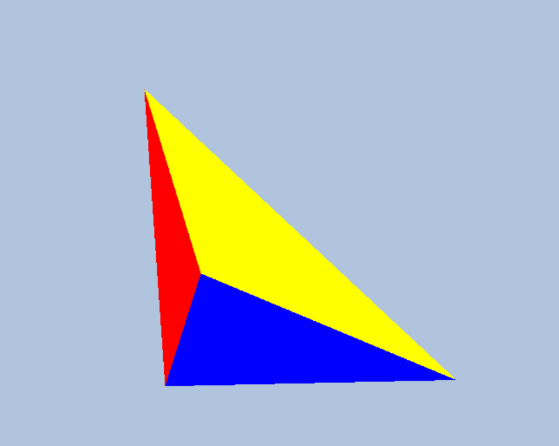
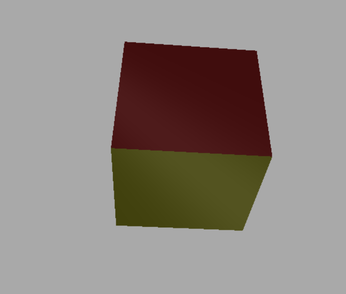

# Graphics Programming Labs

## JOGL

### Lab 1
The main file is located in jogl/src/main/java/edu/ktu/lab1

### Lab 2
The main file is located in jogl/src/main/java/edu/ktu/lab2

### Lab 3
Tetrahedron project is located in dx11/Lab3-1-Tetrahedron

Rotating skull is located in dx11/Lab3-2-Skull

### Lab 4
Cube with lighting is located in dx11/Lab4-LightingCube

